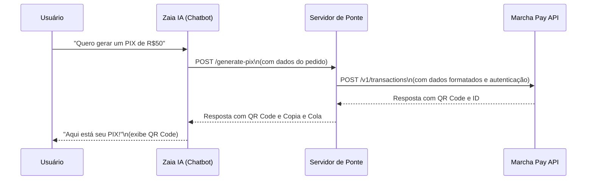

# Ponte de Integração: Zaia IA e LXPay

Este projeto implementa um servidor de ponte (bridge server) que conecta o chatbot **Zaia IA** com a API de pagamentos **LXPay**, permitindo que o agente de IA gere cobranças PIX de forma dinâmica e interativa durante uma conversa.

## Visão Geral

A Zaia IA, por ser uma plataforma no-code, não consegue se conectar diretamente com APIs externas que exigem autenticação complexa ou manipulação de dados. Para contornar essa limitação, este servidor atua como um intermediário seguro:

1.  **Recebe uma chamada simples** da Zaia IA com os dados da cobrança (valor, cliente, etc.).
2.  **Formata e enriquece** esses dados para o padrão exigido pela LXPay.
3.  **Autentica-se de forma segura** na API da LXPay usando as chaves secretas, que nunca são expostas à Zaia IA.
4.  **Cria a transação PIX** e obtém o QR Code e o código Copia e Cola.
5.  **Retorna** essas informações para a Zaia IA, que as exibe ao usuário final no chat.

### Fluxo da Integração



---

## 🚀 Começando

Siga os passos abaixo para configurar e executar o servidor de ponte.

### 1. Pré-requisitos

- **Node.js**: Versão 18 ou superior.
- **Conta na LXPay**: Com chaves de API (pública e secreta) disponíveis.
- **Conta na Zaia IA**: Para configurar o agente e a ação de chamada de API.
- **Servidor para Hospedagem**: Um local para hospedar este servidor de ponte (ex: EasyPanel, Heroku, Vercel, AWS, etc.) para que ele tenha uma URL pública acessível pela Zaia IA.

### 2. Instalação

Clone o repositório e instale as dependências:

```bash
git clone <URL_DO_REPOSITORIO>
cd zaia-marcha-bridge
npm install
```

### 3. Configuração

Crie um arquivo `.env` a partir do exemplo e preencha com suas credenciais da Marcha Pay:

```bash
cp .env.example .env
```

Edite o arquivo `.env`:

```env
# .env
LXPAY_PUBLIC_KEY=sua_chave_publica_aqui
LXPAY_SECRET_KEY=sua_chave_secreta_aqui
PORT=3000
NODE_ENV=production
```

### 4. Executando o Servidor

Para iniciar o servidor em modo de desenvolvimento:

```bash
npm run dev
```

Para produção:

```bash
npm start
```

O servidor estará rodando em `http://localhost:3000`.

---

## ⚙️ Configurando a Zaia IA

Com o servidor de ponte rodando e acessível publicamente, configure a ação de chamada de API na plataforma da Zaia IA.

1.  **Acesse seu Agente na Zaia IA** e vá para o estágio onde a geração de PIX deve ocorrer.
2.  **Crie uma "Ação de Chamada de API"** com as seguintes configurações:

    -   **Nome da Ação**: `Gerar PIX com LXPay`
    -   **Método (Method)**: `POST`
    -   **URL**: `https://sua-url-publica.com/generate-pix` (substitua pela URL do seu servidor de ponte).
    -   **Headers**:
        ```json
        {
          "Content-Type": "application/json"
        }
        ```
    -   **Body**:
        O corpo da requisição deve ser um JSON contendo as variáveis que seu chatbot coletou do usuário. Use as variáveis da Zaia IA (ex: `{{valor_pix}}`, `{{nome_cliente}}`).

        ```json
        {
          "amount": {{valor_pix}},
          "identifier": "{{transaction_id}}",
          "client": {
            "name": "{{nome_cliente}}",
            "email": "{{email_cliente}}",
            "document": "{{documento_cliente}}",
            "phone": "{{telefone_cliente}}"
          },
          "products": [
            {
              "name": "Cobrança via Chatbot",
              "quantity": 1,
              "price": {{valor_pix}}
            }
          ],
          "callbackUrl": "https://sua-url-publica.com/webhook/payment-status"
        }
        ```

3.  **Mapeamento da Resposta**: Configure a Zaia IA para extrair os dados da resposta da sua API (`pix.qrCode`, `pix.copyAndPaste`, `transactionId`) e armazená-los em variáveis do chat.

4.  **Exibição para o Usuário**: No fluxo do chat, use as variáveis preenchidas para mostrar o QR Code e o código Copia e Cola para o usuário.

---

## 🔌 Referência da API da Ponte

### `POST /generate-pix`

Este endpoint cria uma nova transação PIX na LXPay.

**Corpo da Requisição (Request Body)**

| Campo | Tipo | Obrigatório | Descrição |
|-------|------|-------------|-----------||
| `amount` | Number | Sim | Valor da cobrança em formato numérico (ex: 100.00). |
| `identifier` | String | Sim | Identificador único da transação. |
| `client` | Object | Sim | Objeto com os dados do cliente. |
| `client.name` | String | Sim | Nome do cliente. |
| `client.email` | String | Não | E-mail do cliente. |
| `client.document` | String | Não | CPF ou CNPJ do cliente. |
| `client.phone` | String | Não | Telefone do cliente. |
| `products` | Array | Não | Lista de produtos/itens da cobrança. |
| `dueDate` | String | Não | Data de vencimento (formato: YYYY-MM-DD). |
| `callbackUrl` | String | Não | URL para receber notificações de pagamento. |
| `metadata` | Object | Não | Dados adicionais personalizados. |

**Resposta de Sucesso (Success Response)**

-   **Código**: `200 OK`
-   **Conteúdo**:
    ```json
    {
      "transactionId": "trans_c123...",
      "status": "pending",
      "order": {
        "amount": 100.00,
        "currency": "BRL"
      },
      "pix": {
        "qrCode": "data:image/png;base64,...",
        "copyAndPaste": "00020126...",
        "expiresAt": "2024-12-25T10:00:00Z"
      }
    }
    ```

**Resposta de Erro (Error Response)**

-   **Código**: `400 Bad Request` ou `500 Internal Server Error`
-   **Conteúdo**:
    ```json
    {
      "error": "Mensagem descritiva do erro.",
      "message": "Detalhes técnicos do erro"
    }
    ```

### `GET /transaction/:transactionId`

Consulta o status de uma transação PIX.

**Resposta de Sucesso**

```json
{
  "transactionId": "trans_c123...",
  "status": "completed",
  "order": {
    "amount": 100.00,
    "currency": "BRL"
  },
  "pix": {
    "qrCode": "data:image/png;base64,...",
    "copyAndPaste": "00020126...",
    "expiresAt": "2024-12-25T10:00:00Z"
  }
}
```

### `GET /balance`

Consulta o saldo da conta na LXPay.

**Resposta de Sucesso**

```json
{
  "balance": 5000.00,
  "currency": "BRL"
}
```

### `POST /webhook/payment-status`

Endpoint para receber notificações de pagamento da LXPay.

**Corpo da Notificação (Webhook)**

```json
{
  "transactionId": "trans_c123...",
  "status": "completed",
  "amount": 100.00,
  "paidAt": "2024-12-25T10:00:00Z"
}
```

## 🐳 Deploy com Docker

### Construir a imagem

```bash
docker build -t zaia-lxpay-bridge .
```

### Executar o container

```bash
docker run -e LXPAY_PUBLIC_KEY=sua_chave_publica \
           -e LXPAY_SECRET_KEY=sua_chave_secreta \
           -p 3000:3000 \
           zaia-lxpay-bridge
```

## 📦 Deploy no EasyPanel

1. **Crie um novo container** no EasyPanel
2. **Configure as variáveis de ambiente**:
   - `LXPAY_PUBLIC_KEY`: sua chave pública
   - `LXPAY_SECRET_KEY`: sua chave secreta
   - `PORT`: 3000
   - `NODE_ENV`: production
3. **Configure o Dockerfile** ou use a imagem Docker construída
4. **Exponha a porta 3000**
5. **Configure um domínio** para acessar a aplicação

## 📄 Licença

Este projeto está licenciado sob a Licença MIT.

## 🤝 Suporte

Para dúvidas ou problemas, entre em contato com o suporte da LXPay ou Zaia IA.
